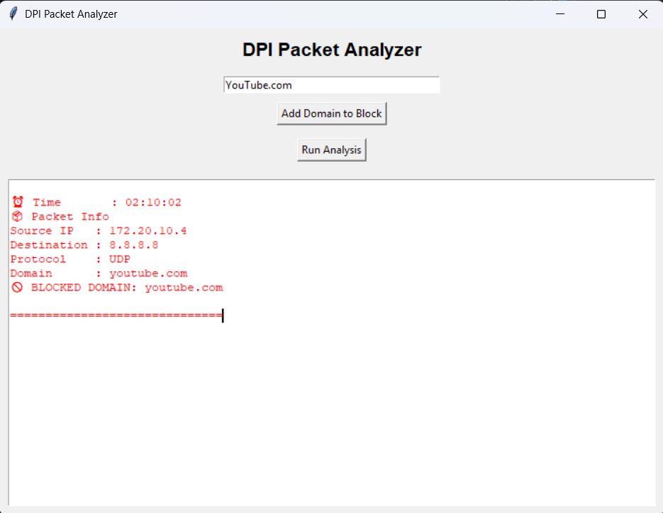

# DPI Packet Analyzer

A GUI-based Deep Packet Inspection (DPI) system for analyzing network packets and implementing rule-based domain filtering using Python.

---

## 🚀 Features
- Packet analysis using Scapy
- DNS domain extraction
- Rule-based domain blocking
- GUI interface using Tkinter
- Dynamic user input for blocking domains
- Timestamp-based packet logging
- Simulation of firewall-like domain filtering behavior

---

## 🧠 How it Works
The system reads packet data from a PCAP file, extracts domain information using DNS parsing, and applies rule-based filtering to block specific domains.

## 🌍 Why This Project?

This project demonstrates how network traffic can be analyzed and controlled using Deep Packet Inspection (DPI). It simulates basic firewall behavior by detecting and filtering domain-based traffic, which is widely used in cybersecurity and network monitoring systems.

---

## 🛠 Technologies Used
- Python
- Scapy
- Tkinter

---

## ▶️ How to Run

1. Install dependencies:
```
pip install scapy
```

2. Run the GUI:
```
python gui.py
```
---

## 📸 Output Screenshot


This GUI shows detected packets and highlights blocked domains in real-time.

## 📸 Output (Example)

GUI displays:
- Source IP
- Destination IP
- Protocol
- Domain name
- Blocked/Allowed status

---

## 📌 Future Improvements
- Real-time packet sniffing
- System-level website blocking
- Advanced protocol analysis

---

## 👨‍💻 Author
Sourav Mahapatra
